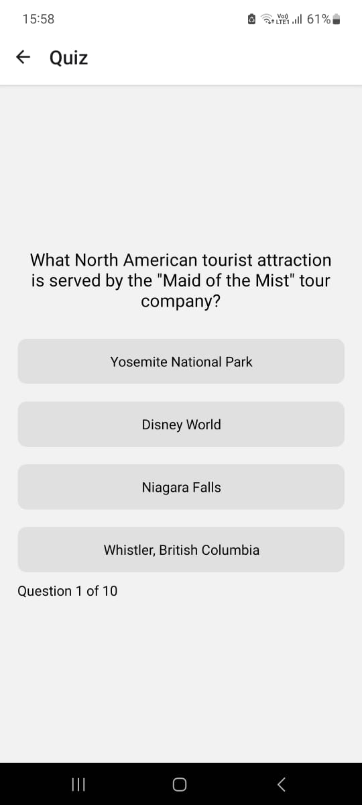

# 🎲 Trivia Quest: React Native Quiz App

## 🌟 Project Overview

Trivia Quest is an engaging mobile quiz application built with Expo React Native that allows users to test their knowledge across various categories. The app provides a seamless experience of selecting quiz parameters, answering questions, and tracking performance through an interactive leaderboard.

### 🎯 Key Features

- User-friendly quiz setup
- Multiple category selection
- Dynamic question count
- Real-time scoring
- Persistent leaderboard
- Simple and attractive UI

## 📸 Screenshots

### Home Screen


- Username input
- Category selection
- Question count adjustment

### Quiz Screen



- Question display
- Multiple-choice options
- Progress tracking

### Results Screen


- Score calculation
- Percentage display
- Restart option

### Leaderboard Screen


- Top performer rankings
- Detailed score information

## 🚀 Installation

### Prerequisites

- Node.js (v14 or later)
- npm or Yarn
- Expo CLI

### Setup Steps

1. Clone the Repository

```bash
git clone https://github.com/Tanmay-say/Trivia-Quiz-App.git
cd TriviaQuizApp
```

2. Install Dependencies

```bash
npm install
# or
yarn install
```

3. Start the Expo Development Server

```bash
npx expo start
```

4. Run on Device/Emulator

- iOS Simulator: Press `i`
- Android Emulator: Press `a`
- Scan QR Code with Expo Go App on Physical Device

## 🛠 Technologies Used

### Frontend

- React Native
- Expo
- React Navigation
- Context API for State Management

### API & Data

- Open Trivia Database API
- AsyncStorage for Local Storage

### Styling

- React Native StyleSheet
- Native Base Components

### Utilities

- Axios (API Requests)
- he (HTML Entity Decoding)

## 📦 Dependencies

Key dependencies include:

- `react-native`
- `expo`
- `axios`
- `@react-navigation/native`
- `@react-navigation/stack`
- `@react-native-async-storage/async-storage`
- `react-native-picker-select`

<!-- ## 🤝 Contributing

Contributions are welcome! Please follow these steps:
1. Fork the repository
2. Create your feature branch (`git checkout -b feature/AmazingFeature`)
3. Commit your changes (`git commit -m 'Add some AmazingFeature'`)
4. Push to the branch (`git push origin feature/AmazingFeature`)
5. Open a Pull Request -->

## 👥 Team & Contributors

### Core Development

- [Tanmay Sayre](https://github.com/Tanmay-say)
- [Aniket Raut](https://github.com/aniketraut16)
- [Ayush Agrawal](https://github.com/TheLearningHead)

### Special Thanks

- Open Trivia Database for providing quiz questions
- Expo Community
- React Native Developers Worldwide

## 📄 License

Distributed under the MIT License. See `LICENSE` for more information.

---

<!-- ## 🎉 Acknowledgments

- Inspired by the love of learning and trivia
- Built with passion for mobile app development

--- -->
